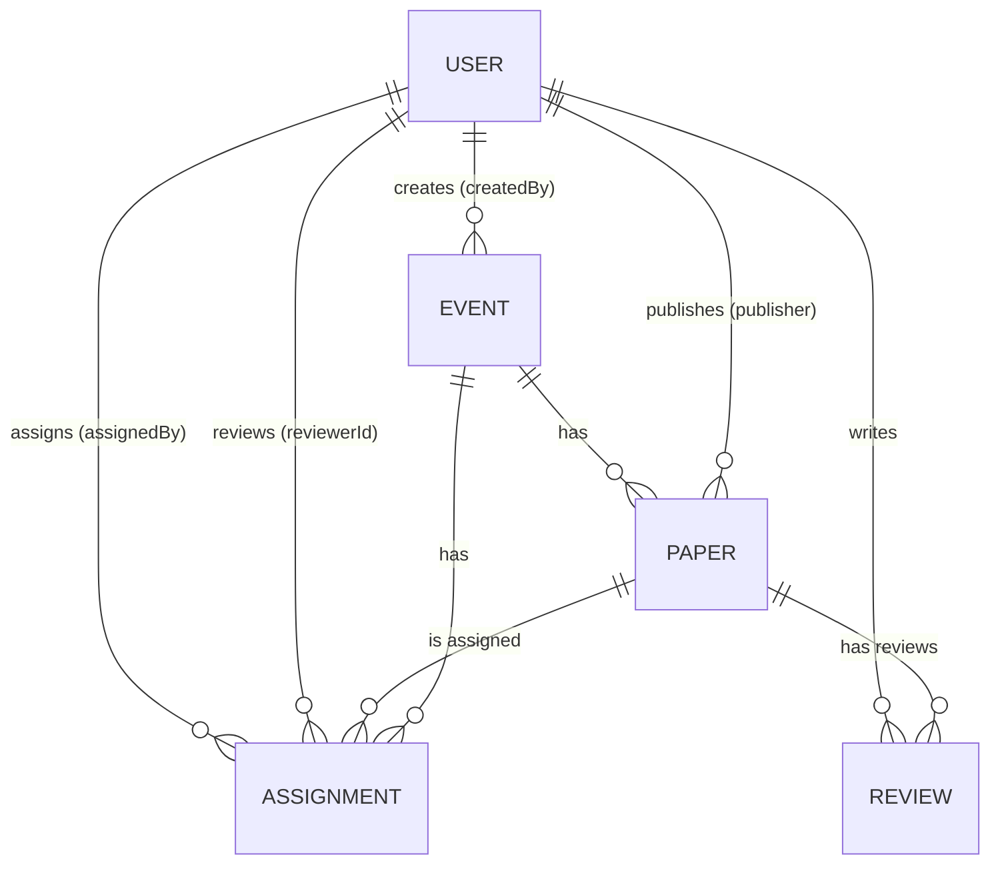

# 🧠 Research Day Support — Backend

> **Node.js + Express + TypeScript + MongoDB backend** for managing **Research Day events**, supporting multi-role authentication, reviewer assignments, AI insights, reminders, and Excel exports.

---

## 📘 Overview

This backend powers the **Research Day management system**, enabling **coordinators**, **authors**, and **reviewers** to collaborate seamlessly in paper submission, review, and decision workflows.  
It integrates **AI-generated insights**, **automated email reminders**, and **Excel exports** for accepted papers.

---

## 🚀 Key Features

### 🔐 Multi-Role Authentication
- Single account can act as both **author** and **reviewer**.
- **Coordinator** serves as the admin.
- **Role Aliases:**
  - `publisher → author`
  - `admin → coordinator`

### 📅 Event & Paper Management
- Coordinators can **create, delete, and view** events.
- Authors can **submit papers** linked to specific events.
- Papers automatically generate **AI insights** upon upload.

### 👥 Reviewer Assignments
- Coordinators can assign papers to reviewers.  
- Unique constraint ensures `(eventId, paperId, reviewerId)` is unique.

### 📝 Review Workflow
- Reviewers add comments, insights, and select/reject papers.
- Coordinators can **override** any paper’s decision.

### 📊 Dashboards & Reports
- **Author dashboard:** summary of submitted papers.  
- **Coordinator dashboard:** statistics of events and submissions.

### 📦 Excel & Email Automation
- Exports accepted papers with reviewer & author info.  
- Automated **daily reminders** sent to reviewers.

---

## 🧩 Tech Stack

| Category | Technology |
|-----------|-------------|
| **Runtime** | Node.js + TypeScript |
| **Framework** | Express |
| **Database** | MongoDB + Mongoose |
| **Authentication** | JWT (Access + Refresh Tokens) |
| **AI Integration** | OpenAI API |
| **Mailing** | Nodemailer (Gmail App Passwords) |
| **Scheduling** | node-cron |
| **Excel Reports** | SheetJS (xlsx) |
| **Logging** | pino + pino-pretty |
| **File Uploads** | multer |
| **PDF Parsing** | pdf2json |

---
```
src/
├─ app.ts # Express app initialization
├─ index.ts # Entry point (server + cron startup)
│
├─ config/
│ └─ env.ts # dotenv setup and validation
│
├─ lib/
│ └─ logger.ts # pino logger setup
│
├─ middlewares/
│ └─ auth.middleware.ts # JWT & role guards (with alias support)
│
├─ models/
│ ├─ user.model.ts
│ ├─ event.model.ts
│ ├─ paper.model.ts
│ ├─ review.model.ts
│ └─ assignment.model.ts
│
├─ routes/
│ ├─ auth.route.ts
│ ├─ admin.route.ts
│ ├─ event.route.ts
│ ├─ paper.route.ts
│ ├─ review.route.ts
│ ├─ author.route.ts
│ ├─ debug.route.ts
│ └─ health.route.ts
│
├─ services/
│ ├─ auth.service.ts
│ ├─ insight.service.ts
│ ├─ mail.service.ts
│ └─ report.service.ts
│
├─ utils/
│ └─ cron.ts # Scheduler (daily jobs)
│
└─ uploads/
├─ events/ # Event banners
└─ papers/ # Uploaded paper files
```

---

## 🧮 Data Model

### 🧱 ER Diagram


```
| Field                 | Type     | Description                         |
| --------------------- | -------- | ----------------------------------- |
| _id                   | ObjectId | Primary key                         |
| name                  | string   | Full name                           |
| email                 | string   | Unique email                        |
| password              | string   | Hashed password                     |
| roles                 | string[] | `author`, `reviewer`, `coordinator` |
| phone                 | string   | Optional                            |
| createdAt / updatedAt | Date     | Auto timestamps                     |
```
```
| Field                 | Type     | Description   |
| --------------------- | -------- | ------------- |
| _id                   | ObjectId |               |
| title                 | string   | Event name    |
| description           | string   | Event details |
| date                  | Date     | Event date    |
| reviewDeadline        | Date     | Optional      |
| bannerUrl             | string   | Optional      |
| createdBy             | ObjectId | FK → USER._id |
| createdAt / updatedAt | Date     |               |
```
```
| Field        | Type     | Description     |            |           |
| ------------ | -------- | --------------- | ---------- | --------- |
| _id          | ObjectId |                 |            |           |
| title        | string   |                 |            |           |
| track        | string   | Paper track     |            |           |
| fileUrl      | string   | File path       |            |           |
| publisher    | ObjectId | FK → USER._id   |            |           |
| eventId      | ObjectId | FK → EVENT._id  |            |           |
| insights     | string[] | Generated by AI |            |           |
| status       | string   | `submitted      | processing | reviewed` |
| adminStatus  | string   | `pending        | approved   | rejected` |
| resultStatus | string   | `submitted      | selected   | rejected` |

```
```
| Field                 | Type                           | Description    |
| --------------------- | ------------------------------ | -------------- |
| _id                   | ObjectId                       |                |
| eventId               | ObjectId                       | FK → EVENT._id |
| paperId               | ObjectId                       | FK → PAPER._id |
| reviewerId            | ObjectId                       | FK → USER._id  |
| assignedBy            | ObjectId                       | FK → USER._id  |
| assignedAt            | Date                           |                |
| createdAt / updatedAt | Date                           |                |
| Unique Index          | (eventId, paperId, reviewerId) |                |
```
```
| Field                 | Type     | Description    |          |           |
| --------------------- | -------- | -------------- | -------- | --------- |
| _id                   | ObjectId |                |          |           |
| paper                 | ObjectId | FK → PAPER._id |          |           |
| reviewer              | ObjectId | FK → USER._id  |          |           |
| comments              | string   |                |          |           |
| insights              | string[] |                |          |           |
| decision              | string   | `pending       | selected | rejected` |
| createdAt / updatedAt | Date     |                |          |           |
```
⚙️ Environment Setup
📁 Create .env in Project Root
```
# Server
NODE_ENV=development
PORT=8080
CLIENT_ORIGIN=http://localhost:3000

# Mongo
MONGO_URI=mongodb://127.0.0.1:27017/urop

# JWT
JWT_ACCESS_SECRET=dev-access
JWT_ACCESS_EXPIRES=15m
JWT_REFRESH_SECRET=dev-refresh
JWT_REFRESH_EXPIRES=7d

# OpenAI
OPENAI_API_KEY=sk-...

# Mail (Gmail App Password)
MAIL_USER=your_gmail@gmail.com
MAIL_PASS=your_app_specific_password
COORDINATOR_EMAIL=coordinator@example.com
```
🧰 Installation
```
# 1️⃣ Install dependencies
npm install

# 2️⃣ Install additional utilities
npm install xlsx nodemailer node-cron pdf2json openai pino-pretty
```
Running the Server
🧑‍💻 Development Mode
```
npm run dev
```
Production Build
```
npm run build
npm start
```
🗂️ File Uploads
```
| Type            | Folder                    | Description                   |
| --------------- | ------------------------- | ----------------------------- |
| Event Banners   | `/src/uploads/events/`    | Accessible via `/uploads/...` |
| Papers          | `/src/uploads/`           | Max 10 MB                     |
| Allowed Formats | `.pdf, .docx, .doc, .txt` |                               |
```
Authentication & Roles
```
| Concept                | Description                                   |
| ---------------------- | --------------------------------------------- |
| **Auth Method**        | JWT via `Authorization: Bearer <accessToken>` |
| **Roles**              | `author`, `reviewer`, `coordinator`           |
| **Aliases**            | `publisher ≡ author`, `admin ≡ coordinator`   |
| **Multi-role Support** | Users can hold multiple roles                 |
```
API Overview
```
| Method | Endpoint             | Description          |
| ------ | -------------------- | -------------------- |
| POST   | `/api/auth/register` | Register new user    |
| POST   | `/api/auth/login`    | Login and get tokens |
```
Coordinator (Admin)
```
POST /api/events/create — create event (banner optional)

GET /api/events — list all events

POST /api/events/:eventId/assign — assign reviewer(s)

PATCH /api/events/:eventId/papers/:paperId/decision — override result

GET /api/events/:eventId/accepted(.xlsx) — accepted list or Excel

GET /api/admin/users — all users

GET /api/admin/papers — all papers

GET /api/admin/event-stats — dashboard stats
```
Author
```
POST /api/events/:eventId/submit — upload paper

GET /api/events/:eventId/my-papers — list author papers

GET /api/author/summary — author dashboard
```
Reviewer
```
GET /api/events/:eventId/assigned — assigned papers summary

POST /api/events/:eventId/reviews/:paperId — add review

PATCH /api/events/:eventId/papers/:paperId/decision — submit decision
```
Debug / Shared
```
GET /api/health

GET /api/debug/whoami

POST /api/debug/mail/reminders

POST /api/debug/mail/report

GET /api/debug/accepted/:eventId
```
Postman Testing Steps
```
| Step             | Role                 | API                                        |
| ---------------- | -------------------- | ------------------------------------------ |
| 1️⃣ Login        | Coordinator          | `/api/auth/login`                          |
| 2️⃣ Create Event | Coordinator          | `/api/events/create`                       |
| 3️⃣ Submit Paper | Author               | `/api/events/:id/submit`                   |
| 4️⃣ Assign Paper | Coordinator          | `/api/events/:id/assign`                   |
| 5️⃣ Review Paper | Reviewer             | `/api/events/:id/reviews/:paperId`         |
| 6️⃣ Set Decision | Reviewer/Coordinator | `/api/events/:id/papers/:paperId/decision` |
| 7️⃣ Export Excel | Coordinator          | `/api/events/:id/accepted.xlsx`            |
```
Background Jobs (Cron)
```
Defined in src/utils/cron.ts and started in src/index.ts.

Runs daily at 09:00:

sendReviewerReminders() — sends pending paper counts.

sendAcceptedReportToCoordinator() — emails accepted paper report.

To change schedule, edit utils/cron.ts.
```
AI Insights Generation
```
On upload, enqueueInsightJob(paperId, fileUrl) is triggered.

Extracts text from PDF/DOC/TXT.

Uses OpenAI GPT-4o-mini to create 3–5 bullet insights.

Updates paper.insights[] and marks as reviewed.
```
Email & Excel

Uses nodemailer with Gmail App Password.

Excel reports generated via SheetJS (xlsx).

Accepted Paper Export Includes:

Reviewer Name

Track

Author Email

Contact Number

Manual Triggers:
```

POST /api/debug/mail/reminders
POST /api/debug/mail/report
GET  /api/debug/accepted/:eventId
```


